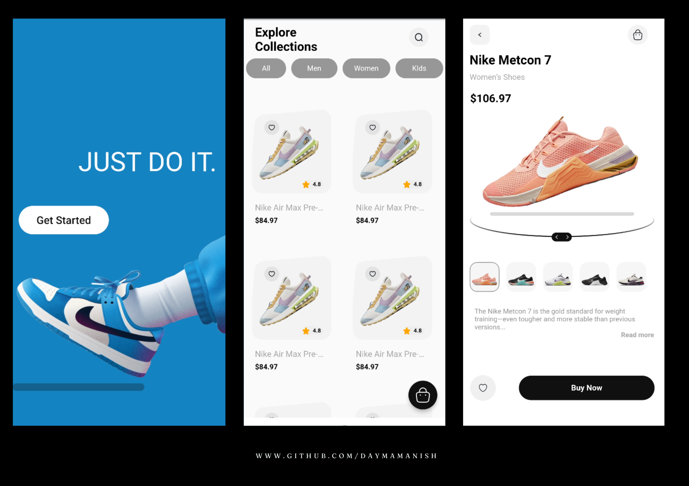

# 🔥FluCommerce - A Flutter Ecommerce Application - Flutter UI🔥


[](https://twitter.com/manishdayma22)
[](https://github.com/DaymaManish)
[](mailto:manishdayma65@gmail.com)

[](https://instagram.com/ishidayma)
[](https://www.linkedin.com/in/daymamanish/)
<a href="https://www.buymeacoffee.com/manishdayma" target="_blank"></a>

Star⭐ the repo if you like to see more stuff on flutter 😉.

## Some Screenshots For You 💖
<br>



<div>
  <h1 align="center">Getting Started with Flutter 🚀 </h1>
  <strong>
    Generated with ❤️ Manish Dayma
  </strong>
  <p>
    This is the documentation of Flutter Applications.
    It contains all the information you need to get started with
    and make changes to your App
  </p>
</div>


### Table of Contents
- [System Requirements](#system-requirements)
- [Figma design guidelines for better accuracy](#figma-design-guideline-for-better-accuracy)
- [App Navigations](#app-navigations)
- [Project Structure](#project-structure)
- [How you can do code formatting?](#how-you-can-do-code-formatting)
- [How you can improve the readability of code?](#how-you-can-improve-the-readability-of-code)
- [Libraries and tools used](#libraries-and-tools-used)
- [Support](#support)

### System Requirements

Dart SDK Version 2.17.0 or greater.
Flutter SDK Version 3.0.0 or greater.

### Figma design guidelines for better accuracy

Read our guidelines to increase the accuracy of design conversion to code by optimizing Figma designs.
https://docs.dhiwise.com/docs/Designguidelines/intro

### App Navigations

Check your app's UI from the AppNavigation screen of your app.

### Project Structure

After successful build, your application structure should look like this:

```
.
├── android                         - contains files and folders required for running the application on an Android operating system.
├── assets                          - contains all images and fonts of your application.
├── ios                             - contains files required by the application to run the dart code on iOS platforms.
├── lib                             - Most important folder in the project, used to write most of the Dart code.
    ├── main.dart                   - starting point of the application
    ├── core
    │   ├── app_export.dart         - contains commonly used file imports 
    │   ├── constants               - contains all constants classes
    │   ├── errors                  - contains error handling classes                  
    │   ├── network                 - contains network related classes
    │   └── utils                   - contains common files and utilities of project
    ├── data
    │   ├── apiClient               - contains API calling methods 
    │   ├── models                  - contains request/response models 
    │   └── repository              - network repository
    ├── localization                - contains localization classes
    ├── presentation                - contains all screens and screen controllers
    │   └── screens                 - contains all screens
    ├── routes                      - contains all the routes of application
    └── theme                       - contains app theme and decoration classes
    └── widgets                     - contains all custom widget classes
```

### How you can do code formatting?

- if your code is not formatted then run following command in your terminal to format code
  ```
  dart format .
  ```

### How you can improve the readability of code?

Resolve the errors and warnings that are shown in the application.

### Libraries and tools used

- get - State management
  https://pub.dev/packages/get
- connectivity_plus - For status of network connectivity
  https://pub.dev/packages/connectivity_plus
- shared_preferences - Provide persistent storage for simple data
  https://pub.dev/packages/shared_preferences
- cached_network_image - For storing internet image into cache
  https://pub.dev/packages/cached_network_image
    
### Support

If you have problems or questions go to our Discord channel, we will then try to help you as quickly as possible: https://discord.com/invite/rFMnCG5MZ7
